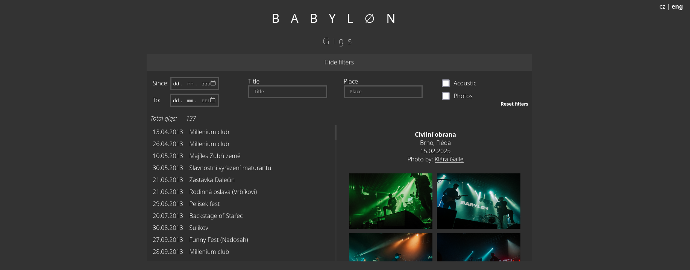

# Babyløn concerts tracking

  

A web application for displaying the history, members, and gigs of the band Babylon, including a photo gallery and interactive timeline.

## Features

- **Gigs List:** Browse gigs with filters for date, title, city, acoustic gigs, and gigs with photos.
- **Photo Gallery:** View gig photos in a fullscreen gallery with navigation.
- **Timeline:** Visualize band members and their roles over the years.
- **Multilingual:** Switch between Czech and English.
- **Responsive Design:** Optimized for both desktop and mobile devices.

## Project Structure

- [`Babylon.html`](Babylon.html): Main HTML file.
- [`babylon.js`](babylon.js): Main application logic (filters, gig list, timeline, etc.).
- [`babylon_db.js`](babylon_db.js): Database of gigs, members, and photographers.
- [`engine.js`](engine.js): Gallery logic and language switching.
- [`const.js`](const.js): Constants used throughout the app.
- [`babylon.css`](babylon.css), [`main.css`](main.css): Styling.
- `babylon_gigs/`: Gig photos.
- `imgs/`: Other images and assets.

## License

See LICENCE.md for license information.
